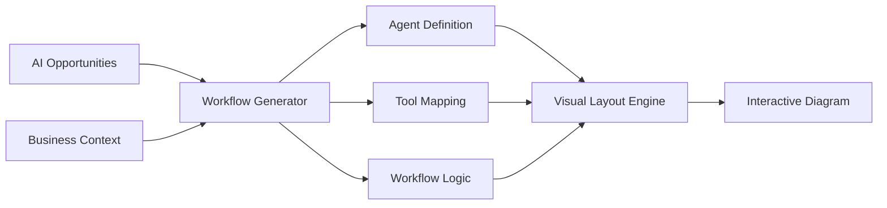

# Agentic Workflow Visualization - Technical Design

**Feature**: AI Opportunities → Visual Agentic Architecture  
**Purpose**: Transform abstract AI opportunities into concrete, understandable workflow diagrams showing how agentic systems will work in the specific business context.

## 🎯 Vision & Value Proposition

### **Current Problem**
Business stakeholders see AI opportunities with ROI projections but struggle to understand:
- "HOW will this actually work in our business?"
- "What does an agentic system look like in practice?"
- "How do agents collaborate to deliver these results?"

### **Solution**
Generate custom agentic workflow visualizations directly from the user's AI opportunities, showing:
- **Specific agents** designed for their business problems
- **Tools and integrations** relevant to their systems
- **Autonomous workflows** that deliver the promised ROI
- **Clear collaboration patterns** between agents

### **Business Impact**
- Transforms abstract AI concepts into tangible implementation plans
- Builds stakeholder confidence in AI implementation
- Provides blueprint for actual development teams
- Completes the Business → Problems → Value → **Implementation** flow

---

## 🏗️ Technical Architecture

### **Input Data Sources**
1. **AI Opportunities** (from profile analysis)
   - Opportunity categories (Process Automation, Decision Support, etc.)
   - Business impact metrics and ROI
   - Specific business problems being solved
   - Recommended implementation approach

2. **Business Context** (from profile)
   - Company systems and applications
   - Industry-specific requirements
   - Strategic initiatives and priorities
   - Team structure and capabilities

### **Core Generation Flow**



### **AI Generation Process**

#### **Step 1: Opportunity Analysis**
- Parse each AI opportunity for automation potential
- Identify required agent types and capabilities
- Map to business processes and systems
- Determine collaboration patterns

#### **Step 2: Agent Architecture Design**
- **Router Agents**: Direct tasks and requests
- **Specialist Agents**: Handle domain-specific work
- **Integration Agents**: Connect to business systems
- **Monitoring Agents**: Track and optimize performance

#### **Step 3: Tool & Integration Mapping**
- Map business systems to agent tools
- Define API integrations and data flows
- Specify automation triggers and conditions
- Plan human handoff points

#### **Step 4: Workflow Orchestration**
- Design agent collaboration patterns
- Define task handoffs and dependencies
- Plan error handling and escalation
- Optimize for business requirements

---

## 🎨 Visual Design Specification

### **Node Types**

#### **Agent Nodes**
```typescript
interface AgentNode {
  id: string;
  type: 'router' | 'specialist' | 'integration' | 'monitor';
  label: string;
  purpose: string;
  capabilities: string[];
  businessValue: string;
  systems: string[]; // Connected business systems
  position: { x: number; y: number };
}
```

#### **Tool Nodes**
```typescript
interface ToolNode {
  id: string;
  type: 'api' | 'database' | 'service' | 'model';
  label: string;
  description: string;
  integration: string; // How it connects to business systems
  usedBy: string[]; // Which agents use this tool
  position: { x: number; y: number };
}
```

#### **Process Nodes**
```typescript
interface ProcessNode {
  id: string;
  type: 'trigger' | 'decision' | 'action' | 'outcome';
  label: string;
  description: string;
  businessProcess: string; // Maps to company's actual processes
  roi: { metric: string; value: string };
  position: { x: number; y: number };
}
```

### **Visual Styling**
- **Agent Nodes**: Rounded rectangles with role-specific colors
- **Tool Nodes**: Hexagons with integration-specific icons
- **Process Nodes**: Diamonds with outcome indicators
- **Connections**: Directed arrows showing data/task flow
- **Annotations**: Hover details with ROI and implementation notes

---

## 💻 Implementation Plan

### **Phase 1: AI Generation Engine**

#### **New Service: `agenticWorkflowService.ts`**
```typescript
export class AgenticWorkflowService {
  static async generateWorkflowFromOpportunities(
    opportunities: AIOpportunity[],
    businessContext: BusinessContext,
    userId: string
  ): Promise<AgenticWorkflow> {
    // Generate workflow architecture using AI
  }
  
  static async optimizeWorkflowLayout(
    workflow: AgenticWorkflow
  ): Promise<LayoutedWorkflow> {
    // Apply graph layout algorithms
  }
}
```

#### **New API Route: `/api/workflow/generate-from-opportunities`**
- Input: User's AI opportunities + business context
- Processing: AI-powered workflow generation
- Output: Structured workflow with nodes, edges, and metadata

### **Phase 2: Visualization Engine**

#### **Enhanced Component: `AgenticWorkflowVisualizer.tsx`**
- Remove ServiceNow dependencies
- Add AI opportunity integration
- Implement new node types and styling
- Add business context annotations

#### **New Layout Engine: `workflowLayoutEngine.ts`**
- Optimize for business process visualization
- Group related agents and tools
- Show clear input/output flows
- Highlight ROI-generating paths

### **Phase 3: Business Integration**

#### **Profile Integration**
- Add "Generate Workflow" button to AI Opportunities tab
- Cache generated workflows in database
- Allow workflow editing and customization
- Export capabilities for technical teams

#### **Navigation Flow**
```
Profile → AI Opportunities → "View Implementation" → Workflow Visualization
```

---

## 🔧 AI Prompt Engineering

### **System Prompt Template**
```
You are an agentic workflow architect. Generate detailed workflow diagrams that show how AI agents will collaborate to deliver specific business outcomes.

Given:
- Business opportunities with ROI projections
- Company systems and processes
- Industry context and requirements

Create:
- Specific agent roles and responsibilities
- Tool integrations with business systems
- Workflow steps that deliver promised ROI
- Clear collaboration patterns between agents

Focus on practical implementation that business stakeholders can understand and technical teams can build.
```

### **User Prompt Template**
```
Generate an agentic workflow for: {opportunity.title}

Business Problem: {opportunity.problem}
Expected ROI: {opportunity.roi}
Target Systems: {businessContext.systems}
Industry: {businessContext.industry}

Create a workflow showing:
1. Which agents will work on this opportunity
2. What tools they'll use from our existing systems
3. How they'll collaborate to deliver the {opportunity.roi}
4. Specific automation steps and decision points

Make it concrete and implementable for our business context.
```

---

## 📊 Success Metrics

### **Technical Metrics**
- Workflow generation time < 30 seconds
- Visual layout quality (no overlapping nodes)
- Integration accuracy with business systems
- User interaction responsiveness

### **Business Metrics**
- Stakeholder comprehension of AI implementation
- Increased confidence in AI investment decisions
- Faster technical team onboarding
- Reduced implementation planning time

---

## 🚀 Future Enhancements

### **Phase 4: Advanced Features**
- **Interactive Simulation**: Show workflow execution with sample data
- **Cost Modeling**: Detailed implementation cost breakdowns
- **Timeline Integration**: Map workflows to timeline phases
- **Team Planning**: Assign agents to development teams

### **Phase 5: Enterprise Features**
- **Multi-Workflow Orchestration**: Show how different opportunities connect
- **Governance Integration**: Compliance and security annotations
- **Performance Monitoring**: Real vs. projected ROI tracking
- **Change Management**: Workflow evolution and optimization

---

## 📝 Implementation Notes

### **Database Schema Updates**
```sql
-- New table for generated workflows
CREATE TABLE agentic_workflows (
  id UUID PRIMARY KEY DEFAULT uuid_generate_v4(),
  user_id UUID REFERENCES auth.users(id),
  profile_id UUID REFERENCES profiles(id),
  opportunity_ids TEXT[], -- Array of opportunity IDs
  workflow_data JSONB,
  metadata JSONB,
  created_at TIMESTAMP DEFAULT NOW(),
  updated_at TIMESTAMP DEFAULT NOW()
);
```

### **File Structure**
```
app/
  services/agenticWorkflowService.ts
  api/workflow/
    generate-from-opportunities/route.ts
  components/workflow/
    AgenticWorkflowVisualizer.tsx
    WorkflowNode.tsx
    WorkflowCanvas.tsx
  utils/workflowLayoutEngine.ts
  lib/llm/prompts/workflowPrompts.ts
```

---

**Status**: Design Phase  
**Next Steps**: Implement Phase 1 - AI Generation Engine  
**Owner**: Development Team  
**Priority**: High (Core Feature Enhancement) 